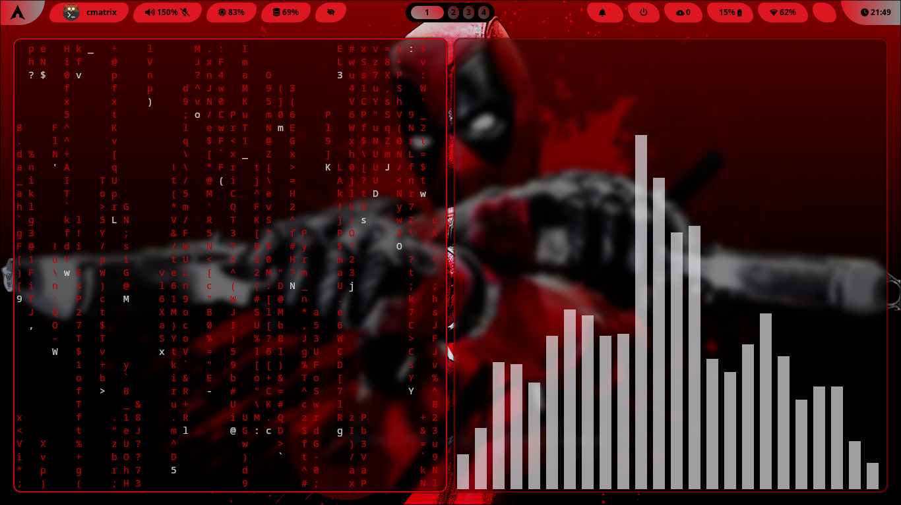

# Hyprdots

**Hyprdots - My Hyprland Dotfiles**

**I USE ARCH,BTW**


This repository contains my **Hyprland** configuration files, neatly organized for easy setup and customization. These dotfiles include configurations for Hyprland, Waybar, Kitty, Zsh, and other essential tools.

## 📌 Features

- **Tiling Window Manager**: Hyprland for a dynamic and minimal workflow.
- **Waybar**: Custom status bar with system stats.
- **Kitty**: Fast and minimal terminal setup.
- **Zsh**: Better shell experience with powerline-style prompt.
- **Custom Keybindings**: Efficient window management and navigation.
- **Theming & Transparency**: Aesthetic look with blur and transparency.

## 🛠️ Installation

### Clone the Repository

```bash
git clone https://github.com/dineshkumars04/Hyprdots.git ~/.dotfiles
```

## 🔧 Keybindings

| Action            | Keybinding              |
| ----------------- | ----------------------- |
| Open Terminal     | `Super + Enter`         |
| Launch Rofi       | `Super + D`             |
| Close Window      | `Super + Q`             |
| Toggle Float      | `Super + Shift + Space` |
| Move Focus        | `Super + Arrow Keys`    |
| Switch Workspaces | `Super + [1-9]`         |

## 🎨 Theming

- **GTK Theme**: Breeze
- **Icons**: Tela-circle-dark
- **Fonts**: Noto sans

## 📷 Screenshots



